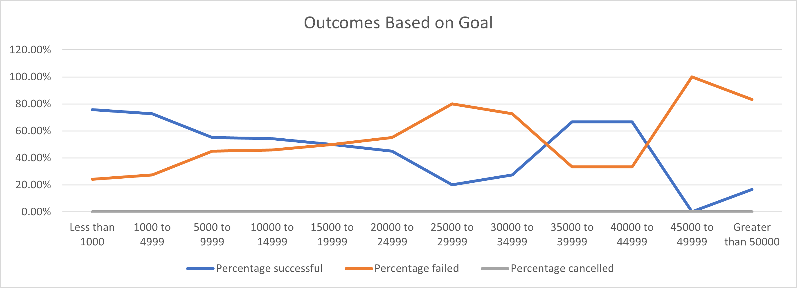

# Kickstarting with Excel

## Overview of Project
Louise, an up and coming playwright, wants to start a crowdfunding campaign, to help fund her play *Fever*. She has estimated a budget of more than USD $10,000. She is in need of an analysis of crowdfunding data to find out what makes campaigns successful.

### Purpose
Provide an analysis of crowdfunding trends based on performance data from past crowdfunding campaigns. This analysis will be used to make strategic decisions for Louise's crowdfunding campaign.

## Analysis and Challenges
Started off with a [spreadsheet (zipped file)](Kickstarter_challenge.zip) of past [Kickstarter](https://www.kickstarter.com/) campaigns for the years 2009 through 2017. The set of data spans multiple countries and categories and subcategories, and indicates the resulting outcomes, as well as goal and pledge amounts.

### Weeding and Sorting through the Data
- The data was first cleaned up a bit, by converting the dates to a readable format, and extracting the launch year. 

- The category and subcategory were available as a single field, so they were extracted into two separate fields.

- The percentage funded was calculated by comparing the percentage of pledged vs the goal amounts.

- The average donation was calculated by dividing the total pledged by the number of backers. Note that some error handling had to be used to account for zero backers or non-numerical values of these.

- The data was then filtered via a `pivot table` to show the outcomes for ***theater*** categories only. The three different outcomes (successful, failed or cancelled) were then charted per each month of the year.

- Lastly, the data was, filtered by the ***plays*** subcategory, and siloed into goal ranges of roughly USD $5,000 ending with campaigns above $50,000 goals. These silos were classified and charted according to their outcomes.

### Analysis of Outcomes Based on Launch Date
The following chart depicts the number of **theater** campaigns between the years 2010 and 2017, per month, that were either successful, failed, or cancelled.

The chart reveals that May is the launch month that has had the highest number of successful campaigns, followed by June. Successful outcomes start trending upwards from the month of March, having a peak in May, and then peter out as the year progresses. 

The trend appears to be mirrored by the number of campaign failures, but the overall number of failures is smaller, and the changes less dramatic, with a less dramatic peak in May that repeats in October. In orders of magnitude, the values are somewhat similar throught the summer months.

The number of cancelled outcomes is even smaller, with the highest likelyhood of being cancelled if the campaign is launched in January. These might be interesting as a point of reference, but less relevant, since none of the campaigns within the plays subcategory were cancelled.

### Analysis of Outcomes Based on Goals
The chart below shows the percentage of campaigns for **plays** that succeeded, failed, or were cancelled based on the initial goal amount.

The projects with the highest chance to succeed were those with a goal amount less than USD $1,000. 

The chance goes down as the goal goes up, hovering around the 50/50 chance for goals between $5,000 and $25,000. After continuing to go down, it increases back up (to around 66%) for goal amounts between $35,000 and $45,000.

### Challenges and Difficulties Encountered
I have made the assumption that all of the goal and pledge numbers are listed in the same currency, even though the data is for multiple countries, and their currencies are listed. If these amounts were listed in different currencies, then a possible strategy would have been to create a new column with a conditional based on the currency column that uses exchange rates to make the conversion.

I did try to find a way to use an AND conditional nested inside the COUNTIFS calculation. But while researching, realized this would have been cumbersome, since the `criteria_range` value would have had to be called twice. Furthermore, the function is already employing the AND conditional with each new additional criteria.

## Results
#### Based on the launch date:
- The most likely launch month to succeed is May, siince 111 out of 166 plays succeeded (a roughly 2 out of 3 chance), closely followed by June (100 out of 153).
- The most likely launch month to have your campaign cancelled is January (a roughly 7% chance). This statement comes with a caveat: as shown by the second chart, none of these theater campaigns were for plays, but good to know as a guideline.
- The most likely launch month to fail is December, with 37 plays failed out of 75 (a roughly 1-1 chance).

#### Based on the goal amounts:
- There is close to an 80% success rate for goals up to $5,000.
- Although the success rate goes down for higher goals, there is an increase for projects that have a goal hovering around the $40,000 mark. It is noteworthy that there are fewer projects in this range. The smaller sample would make results in this range less reliable/predictable. It may also be worthwhile to find out the reason for these successes. Do these campaigns offer additional perks? Are these plays special in any other way?

#### Some limitations of the data
The data ends in the year 2017. If Louise is planning her campaign for the following ear, it would be useful to see how these numbers have been impacted post-COVID. It would also have been useful to have data for the years 2008-09, when many countries were in an economic recession.

The dataset, appears to originate from Kickstarter. It would also be useful to be able to see data from other crowdfunding sites.

#### Other possible tables/charts that could be created
The report is basing conclusions on international outcomes. It might be useful to compare using U.S. only plays. 

It could also be helpful to find out the relationship between the goal amount, and the average donation and the number of backers, and how these influence the success rate.

The **outcomes based on goals** analysis might provide more precise infomation for an goal amount decision if it was more granular. It could be that campaign goals of $6,000 or $7,000 might still have a good chance of success.
